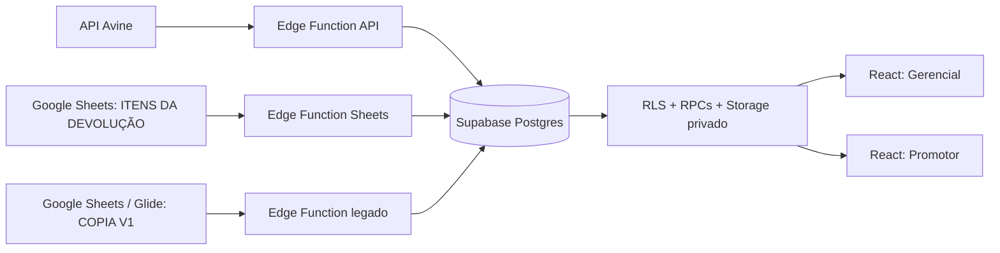

# Handover técnico — FSTD Avine

> Documento de transição para manutenção do projeto. Levantado em 28/08/2026 a partir do código, migrations e configuração presentes no repositório.

## Leitura rápida

O FSTD Avine é o sistema de gestão de devoluções da Avine Alimentos. Ele substitui gradualmente aplicações Glide e planilhas por uma aplicação web React/Vite e um backend Supabase.

| Produto | Rota | Público | Uso principal |
| --- | --- | --- | --- |
| Gerencial | `/admin` e `/gerencial` | Admin e Gerencial | Dashboard, NFDs, fotos, usuários, lojas e roteirização. |
| FSTD Digital | `/acesso/promotor` | Promotor | Consultar lojas atribuídas, abrir NFDs, preencher/finalizar FSTD e anexar evidências. |

O Supabase é a fonte operacional. Google Sheets e a API Avine são fontes de importação, não o banco de leitura da interface. Glide ainda é origem do histórico complementar `COPIA V1`.



### Estado desta inspeção

- O levantamento usa a árvore de trabalho atual: 131 arquivos de código em `src`, 77 migrations versionadas, 45 arquivos de teste e seis diretórios de Edge Functions (um, `sync-devolucoes-avine`, é legado/não configurado).
- Havia mudanças locais não commitadas, inclusive migrations e documentação; elas foram preservadas. Este documento não atesta que essas mudanças já foram aplicadas em produção.
- `npx supabase@2.109.1 migration list` não conseguiu consultar o projeto remoto: a conta atual recebeu HTTP 403 de acesso à plataforma. Portanto o schema abaixo é uma reconstrução de `supabase/migrations` e `src/types/database.types.ts`, não uma auditoria ao vivo da produção.

## Repositório e execução

| Item | Valor |
| --- | --- |
| Runtime | Node 22 (`.nvmrc` e `package.json`) |
| Frontend | React 19, React Router 7, TanStack Query 5 e Vite 8 |
| Backend | Supabase Auth, Postgres, RLS, Storage, Edge Functions, `pg_cron`, `pg_net` e Vault |
| Linguagens | JavaScript/JSX no legado de UI, TypeScript nos domínios e Deno/TypeScript nas Functions |
| Deploy web | Vercel, com rewrite SPA em `vercel.json` |
| Pacote | npm; `package-lock.json` é o lockfile |

```powershell
nvm use
npm ci
Copy-Item .env.example .env.local
npm run dev

# validação do frontend
npm run lint
npm run typecheck
npm run test
npm run build
npm run check:bundle
npm run verify

# E2E; precisa de credenciais E2E no ambiente
npm run test:e2e
```

O CI em `.github/workflows/ci.yml` executa audit npm (nível alto), lint, typecheck, Vitest, build, orçamento de bundle, Playwright e um banco local Supabase com pgTAP e lint SQL.

### Configuração local mínima

O navegador só recebe credenciais publicáveis:

```dotenv
VITE_SUPABASE_URL=https://<project-ref>.supabase.co
# ou VITE_SUPABASE_PROJECT_ID=<project-ref>
VITE_SUPABASE_PUBLISHABLE_KEY=sb_publishable_...
```

`CRON_SECRET` não é uma variável de frontend. O exemplo a contém apenas para uso dos scripts administrativos; não a publique, não a coloque em `VITE_*` e não a use no cliente React.

## Arquitetura do código

### Entrada e providers

1. `src/main.jsx` monta `AppProviders` e `RootApp`.
2. `src/app/providers/AppProviders.jsx` cria `QueryClient`, instala `BrowserRouter` e `AuthProvider`; também interrompe a inicialização quando faltam as variáveis públicas do Supabase.
3. `src/app/RootApp.jsx` carrega as aplicações por `lazy()`, protege rotas com `RequireRole` e trata recuperação de senha pelo hash do Supabase Auth.

| Caminho | Destino |
| --- | --- |
| `/` | Login/entrada por papel |
| `/esqueci-senha` | Solicitação de recuperação |
| `/redefinir-senha` | Redefinição de senha |
| `/admin/*` | Aplicação Gerencial, apenas Admin |
| `/gerencial/*` | Aplicação Gerencial, apenas Gerencial |
| `/acesso/promotor/*` | Aplicação Promotor, apenas Promotor |
| `/promotor/*` | Redirecionamento de compatibilidade para `/acesso/promotor/*` |

### Organização por domínio

| Área | Responsabilidade e pontos de entrada |
| --- | --- |
| `domains/auth` | Sessão, perfil, papéis, capacidades visuais e guardas de rota. |
| `domains/users` | Leitura e tipos de usuários; mutações administrativas passam pela Edge Function. |
| `domains/stores` | Lojas e a matriz loja/promotor. |
| `domains/invoices` | NFDs, status e início de FSTD a partir de uma nota. |
| `domains/fstd` | Regras/validações, repositórios, fluxo por produto, PDF, fotos e legado. |
| `domains/promotor` | Consultas que compõem a área do promotor. |
| `domains/dashboard` | RPC agregada e cálculos de apresentação do painel. |
| `apps/gerencial` e `apps/promotor` | Casca e telas de cada produto. |
| `shared` | Cliente Supabase, erros, paginação, componentes e tokens comuns. |

Os repositórios de domínio são a fronteira principal entre React e Supabase. Antes de alterar um contrato, procure tanto o nome da tabela/RPC como o repositório consumidor. Há código visual concentrado em `src/apps/gerencial/GerencialApp.jsx` e `src/domains/fstd/components/PromotorWorkspace.jsx`; alterações nesses arquivos exigem teste focalizado.

### Estrutura de pastas, em detalhe

```text
src/
├── main.jsx                         # Bootstrap React
├── app/
│   ├── RootApp.jsx                   # Rotas globais e lazy loading
│   ├── routePaths.js                 # Fonte única dos caminhos públicos
│   └── providers/AppProviders.jsx    # QueryClient + Router + AuthProvider
├── apps/
│   ├── gerencial/                    # Casca, navegação e telas gerenciais
│   │   └── features/                 # Dashboard, FSTD, fotos, lojas e shell
│   └── promotor/                     # Casca e estado de navegação do promotor
├── domains/                          # Regras de negócio e acesso a dados por assunto
│   ├── auth/                         # Sessão, papel e guards
│   ├── dashboard/                    # Contrato da dashboard e seus cálculos
│   ├── fstd/                         # Agregado principal do sistema
│   ├── invoices/                     # NFDs e seus status
│   ├── promotor/                     # Consultas compostas do workspace
│   ├── stores/                       # Lojas/roteirização
│   └── users/                        # Perfil e usuários gerenciados
├── shared/
│   ├── api/                          # Paginação genérica
│   ├── components/                   # Componentes compartilhados, inclusive Auth
│   ├── errors/                       # Normalização de erros em AppError
│   ├── lib/supabaseClient.ts          # Único cliente browser do Supabase
│   ├── ui/                           # Controles visuais reutilizáveis
│   └── styles/                       # Tokens de design
└── types/
    ├── database.types.ts              # Gerado do schema; não editar manualmente
    └── database.helpers.ts            # Helpers tipados de RPC

supabase/
├── migrations/                        # Linha do tempo imutável do banco
├── functions/
│   ├── _shared/                       # Parsers/normalizadores reaproveitados
│   └── <function>/index.ts            # Uma API HTTP Deno por diretório
├── tests/                             # pgTAP: banco/RLS/RPC
└── config.toml                        # Topologia local, Auth e Functions
```

| Arquivo/grupo | Leia quando precisar... | Observação de manutenção |
| --- | --- | --- |
| `shared/lib/supabaseClient.ts` | Alterar credenciais, persistência de sessão ou cliente web | Não crie outro `createClient` no browser. Só a chave publicável pode chegar aqui. |
| `domains/auth/AuthProvider.jsx` | Alterar login, recuperação, expiração ou requisito de acesso | A validação compara sessão, `auth.getUser()`, perfil e `app_metadata.role`. |
| `domains/auth/model/capabilities.ts` | Mostrar/esconder uma ação por papel | Atualizar capability não concede acesso ao banco. Alterar a RLS/RPC correspondente. |
| `domains/*/*Repository.*` | Alterar consulta/mutação do banco | Estes arquivos devem ser a primeira escolha para novas chamadas à Data API/RPC. |
| `domains/fstd/model/*` | Alterar validações e comandos da FSTD no cliente | Regra crítica precisa existir também na RPC/migration; nunca somente aqui. |
| `domains/fstd/api/fstdRepository.ts` | Alterar o contrato tipado de RPC/Storage FSTD | `database.helpers.ts` mantém os argumentos e retornos tipados. |
| `domains/fstd/attachedPhotosRepository.js` | Alterar galeria de fotos | Assina URLs por uma hora e faz cache com margem de um minuto. |
| `apps/gerencial/GerencialApp.jsx` | Alterar composição das telas gerenciais | Arquivo grande e legado; extraia lógica/repositório antes de acrescentar chamadas SQL. |
| `domains/fstd/components/PromotorWorkspace.jsx` | Alterar experiência móvel FSTD | É o principal orquestrador visual do fluxo de campo; preserve a ordem upload → RPC → limpeza em erro. |
| `apps/promotor/navigationState.ts` | Alterar retomada da navegação | Usa `sessionStorage` isolado pelo id do perfil e é limpo no logout. |
| `supabase/functions/manage-users/index.ts` | Alterar contas/perfis | É a única rota autorizada para Admin API no fluxo atual. |
| `supabase/functions/_shared/*` | Alterar importações API/Sheets | Teste parser e normalização separadamente antes de implantar a Function consumidora. |

### Caminho de dados no frontend

Cada interação deve obedecer à sequência abaixo. Ela evita que componentes carreguem detalhes de persistência e permite testar domínio sem renderizar a tela inteira.

```text
Evento de UI
  → componente de app/feature
  → hook (quando há cache, loading ou mutation)
  → repository/repository factory
  → supabase.from(...), supabase.rpc(...) ou supabase.storage
  → Data API/RPC/Storage com JWT
  → RLS, grants e validações SQL
  → resposta normalizada (AppError quando necessário)
  → invalidação/atualização do React Query e nova renderização
```

Exemplos reais:

| Caso | Cliente | Backend que decide |
| --- | --- | --- |
| Entrar | `AuthProvider.signIn` → `signInWithPassword`, `getUser`, `usuarios` | Supabase Auth; RLS em `usuarios`; coerência de papel no cliente e banco. |
| Listar NFD gerencial | `invoicesRepository.list...` | RPC `listar_nfd_notas_gerencial`, com filtro e escopo no SQL. |
| Iniciar FSTD | `fstdRepository.startProducts` | `iniciar_fstd_produtos_v2`; deriva produto/quantidade de `nfd_itens`. |
| Salvar produto | `useFstdSave` → `fstdRepository.saveProduct` | RPC de concluir/editar; valida totais, motivos e caminhos de foto. |
| Exibir foto | `attachedPhotosRepository` | RLS em tabelas/Storage e URL assinada de `fstd-fotos`. |
| Criar usuário | tela gerencial → `functions.invoke('manage-users')` | Function valida o chamador e só então usa Admin API. |

### Cache, estado e erros

- `AppProviders` configura React Query com `refetchOnWindowFocus: false` e uma tentativa de retry. Não assuma atualização em tempo real: o projeto não usa Realtime como contrato de UI.
- Queries/mutations novas devem ter chave de cache estável e invalidar apenas as consultas afetadas. Cache não substitui RLS nem é fonte de verdade.
- O estado de navegação do Promotor fica em `sessionStorage`, não no banco; é uma conveniência de sessão e pode ser descartado.
- Repositórios convertem falhas Supabase em `AppError` por `shared/errors`, para que a interface mostre uma mensagem de negócio sem expor detalhes internos.
- A paginação direta usa `shared/api/pagination.ts`; não baixe todas as linhas de tabelas crescentes quando houver RPC paginada disponível.

### Aplicação Gerencial

O menu atual expõe Dashboard, Notas, Fotos, Usuários e Lojas:

- **Dashboard**: indicadores financeiros, produtos, motivos e índice de retorno por loja. Usa a RPC `carregar_dashboard_gerencial`.
- **Notas**: listagem paginada, filtros por período/status/UF/cidade e busca textual ou numérica via `listar_nfd_notas_gerencial`; abre/preenche FSTD e marca NFD conhecida/desconhecida conforme autorização.
- **Fotos**: lista evidências de FSTDs finalizadas, cria URLs assinadas e abre detalhes/PDF. A hidratação das fotos tem cache de 59 minutos por página.
- **Usuários**: gestão de Admin, Gerencial e Promotor. O cliente chama `manage-users`; não deve chamar Admin API ou atualizar `auth.users`.
- **Lojas**: CRUD e roteirização de até três promotores por loja, ordenados por `loja_promotores.posicao`.

### Aplicação Promotor

O promotor vê exclusivamente dados autorizados pela RLS: lojas atribuídas, NFDs por estado (atrasada, finalizada, avulsa e desconhecida), FSTDs em curso e histórico legado. O fluxo normal é:

1. Selecionar uma loja e NFD importada.
2. Iniciar a FSTD com `iniciar_fstd_produtos_v2`.
3. Preencher cada produto: divisão por motivos, retorno, observação e fotos.
4. Concluir produtos e finalizar com `finalizar_fstd_produtos`.
5. Obter/criar o documento, gerar PDF no cliente, salvar uma vez em `fstd-pdfs` e abrir por URL assinada.

O app também permite FSTD avulsa, desconhecimento de NFD e edição controlada de FSTD finalizada por Gerencial/Admin. Quantidades faturadas, produtos e vínculo com a NFD não são confiados ao cliente: as RPCs os conferem e derivam no servidor.

## Identidade, autorização e papéis

`AuthProvider` lê a sessão Supabase e busca o perfil correspondente em `public.usuarios`. Para conceder acesso, o cliente exige sessão válida e perfil ligado por `auth_user_id`, flags `ativo` e `acesso_habilitado`, e o par coerente entre `usuarios.perfil` e `auth.users.app_metadata.role`: `Admin/admin`, `Gerencial/gerencial` ou `Promotor/promotor`.

As capacidades em `domains/auth/model/capabilities.ts` controlam somente UX. Elas não são uma autorização de banco; toda operação relevante continua protegida por grants, RLS, RPC ou Edge Function.

| Papel | Escopo |
| --- | --- |
| Admin | Global; administra usuários, lojas e operações restritas. Não pode remover/rebaixar o último Admin ativo nem bloquear a si próprio. |
| Gerencial | Uma ou mais UFs; consulta e opera somente seu recorte e administra Promotores desse escopo. |
| Promotor | Exatamente uma UF e somente lojas vinculadas em `loja_promotores`; faz o trabalho de campo. |

`usuarios` (perfil operacional) e a conta Auth têm ciclo de vida separado. Ao excluir acesso, a conta Auth é removida/desvinculada, mas o perfil e o histórico operacional são preservados para manter referências das FSTDs.

## Supabase: modelo de dados e contratos

### Como o Supabase é usado neste projeto

Supabase não é apenas “o banco”. Neste sistema ele reúne seis responsabilidades, cada uma com um limite de segurança diferente:

```text
React (chave publicável + JWT do usuário)
  ├─ Auth       → identifica a pessoa e emite/renova a sessão
  ├─ Data API   → executa consultas em tabelas/views com grants + RLS
  ├─ RPC        → executa regras transacionais no Postgres
  └─ Storage    → guarda fotos/PDFs, também sujeito a policy

Jobs/Edge Functions (segredo server-side)
  ├─ Edge Functions → integrações HTTP e Admin API
  └─ Postgres/Vault → agendamento, segredo e auditoria de execução
```

#### 1. Cliente browser, Data API e JWT

`src/shared/lib/supabaseClient.ts` é o único ponto que cria o cliente `@supabase/supabase-js` do navegador. Ele recebe `VITE_SUPABASE_URL` ou forma a URL a partir de `VITE_SUPABASE_PROJECT_ID`, e usa exclusivamente `VITE_SUPABASE_PUBLISHABLE_KEY`.

Depois do login, o SDK envia o access token automaticamente em chamadas como:

```ts
supabase.from('lojas').select('id, codigo, nome, uf, cidade')
supabase.rpc('iniciar_fstd_produtos_v2', { p_loja_id, p_nfd_chave_acesso })
supabase.storage.from('fstd-fotos').upload(path, file)
```

O token identifica o usuário no Postgres por `auth.uid()` e disponibiliza os claims JWT. A chave publicável permite alcançar a Data API, mas não ignora grants ou RLS. A chave secreta/service role nunca deve aparecer em `src/`, `.env.local` com prefixo `VITE_`, bundle, DevTools ou log do navegador.

#### 2. Auth e perfil operacional

Auth guarda credenciais, sessão e `app_metadata.role`; `public.usuarios` guarda o perfil de negócio (nome, UFs, flags e id operacional). Os dois registros precisam continuar consistentes.

| Fase | Auth | `usuarios` | Ponto de código |
| --- | --- | --- | --- |
| Login | Confere e-mail/senha e cria sessão | É consultada pelo `auth_user_id` da sessão | `AuthProvider.signIn`/`resolveProfile` |
| Abertura/retorno à aba | `getSession()` e `getUser()` confirmam a identidade | Perfil é recarregado; `record_usuario_access` registra o acesso | `AuthProvider.validateSession` |
| Administração | `manage-users` cria/atualiza/bloqueia o usuário via Admin API | Function cria/atualiza/desvincula o perfil | Edge Function `manage-users` |
| Exclusão de acesso | Conta Auth é removida | Perfil histórico fica sem `auth_user_id`/acesso | Edge Function `manage-users` |

`app_metadata` é a origem aceitável de papel no JWT. Não use `user_metadata` para autorização: é editável pelo próprio usuário. Como claims só mudam após refresh do token, mudanças administrativas devem considerar logout/revalidação de sessão; a aplicação já revalida ao retomar foco e ao expirar sessão.

#### 3. Grants, RLS e views: quem pode ler o quê

Há três controles complementares, e confundi-los causa incidentes:

| Controle | Pergunta que responde | Exemplo no projeto |
| --- | --- | --- |
| Grant | O papel PostgreSQL pode tentar acessar este objeto? | `authenticated` recebe `SELECT`/`EXECUTE` somente no contrato usado pelo app. |
| RLS | Quais linhas esse usuário pode acessar/mutar? | Promotor só recebe lojas atribuídas e processos próprios; Gerencial recebe UFs autorizadas. |
| RPC/Function | A sequência de alterações respeita a regra de negócio? | Finalizar só funciona quando todos os produtos, motivos e fotos atendem às regras. |

Um `SELECT` no React não é livre: passa pela Data API, pelo grant e pela policy. Assim, `listPromotorStores()` chama `from('lojas')` sem passar um id de promotor, mas RLS devolve apenas as lojas que o usuário atual pode ver. O filtro de interface melhora a experiência; ele não é o controle de segurança.

Para mudanças de tabela/view, confirme sempre: tabela está exposta à Data API? há grant explícito? RLS está habilitada? a policy usa `TO authenticated` **e** predicado de propriedade/escopo? Views de `public` devem usar `security_invoker = true` ou permanecer fora da API.

#### 4. Por que operações FSTD são RPCs

FSTD é uma operação multi-tabela. Um simples `update` pelo cliente permitiria adulterar quantidade faturada, produto, dono do processo ou referência a foto. Por isso, o banco centraliza a sequência:

```text
iniciar_fstd_produtos_v2
  → verifica usuário ativo e acesso à loja
  → encontra NFD autorizada
  → deriva itens/quantidades de nfd_itens
  → cria ou retoma processo e produtos

concluir/editar produto
  → verifica propriedade/escopo e status
  → valida divisões por motivo e quantidades
  → valida que cada caminho de foto pertence ao autor/processo
  → persiste produto e seus motivos de forma consistente

finalizar_fstd_produtos
  → exige todos os produtos concluídos
  → muda processo para concluída
  → cria fstd_documentos e número de controle na mesma transação
```

Algumas RPCs necessitam `SECURITY DEFINER` para realizar uma operação controlada. Isto não torna a RPC “administrativa”: ela revoga `EXECUTE` de `PUBLIC`, concede somente a `authenticated`, valida `auth.uid()`/perfil/escopo e fixa o `search_path`. Qualquer RPC nova com esse atributo deve repetir esse padrão e ganhar teste de negação de acesso.

#### 5. Storage: objetos privados não são URLs públicas

O Storage contém arquivos, enquanto `fstd_produtos.fotos` armazena apenas caminhos. O cliente envia o arquivo para o bucket, depois a RPC valida os caminhos antes de associá-los ao produto. Para leitura, a aplicação pede uma URL assinada com prazo de 3.600 segundos; ela não usa URL pública permanente.

| Bucket | Conteúdo | Acesso esperado |
| --- | --- | --- |
| `profile-photos` | Foto de apresentação do usuário | Proprietário nos limites definidos e visualização autorizada. |
| `fstd-fotos` | Evidências por produto FSTD | Promotor só na própria pasta/processo; Gerencial/Admin dentro do escopo RLS. |
| `fstd-pdfs` | PDF final da FSTD | Gravado uma vez pelo fluxo e entregue por URL assinada. |

Em upload com `upsert`, Storage exige as permissões de INSERT, SELECT e UPDATE. O repositório da FSTD usa `upsert: false`; não altere esse padrão para sobrescrever evidências sem uma regra e trilha de auditoria explícitas.

#### 6. Edge Functions, cron e Vault

Edge Functions executam em Deno fora do navegador. Elas são usadas quando é necessário chamar uma API externa, usar chave privilegiada ou tocar Supabase Auth Admin API. Funções de sincronização têm `verify_jwt = false` no `config.toml` porque são chamadas por cron, mas isso não as torna públicas: `requireCronAuthorization` exige `x-cron-secret` em toda chamada.

O cron fica dentro do Postgres. `pg_cron` executa a agenda, `pg_net` faz o `http_post` para a Function e o valor secreto é lido de `vault.decrypted_secrets` como `avine_cron_secret`. O SQL de migration nunca materializa o segredo. Cada execução registra começo, resultado ou erro em `nfd_logs`.

#### 7. Schema, migrations e tipos

O banco local sobe com PostgreSQL 17 conforme `supabase/config.toml`; migrations são aplicadas em ordem de timestamp. `src/types/database.types.ts` é uma fotografia tipada do schema: tabelas, views, argumentos/retornos de RPC e enums. Já `database.helpers.ts` permite que repositórios TypeScript chamem RPCs com nomes/argumentos corretos.

A regra é vertical: criar coluna/RPC/policy implica criar migration forward-only, atualizar tipos gerados, ajustar repositório e UI, e acrescentar teste SQL/JS quando aplicável. Nunca “corrija” produção alterando uma migration histórica; produza outra migration que evolua o estado atual.

### Entidades principais

| Grupo | Tabelas | Contrato |
| --- | --- | --- |
| Pessoas e escopo | `usuarios`, `lojas`, `loja_promotores` | Usuário operacional, loja e atribuição posicional. A loja e o Promotor devem ter a mesma UF. |
| Catálogos | `motivos_devolucao`, `produtos` | Motivos e catálogo/mapeamento de produtos. |
| Importação de NFD | `nfd_itens`, `nfd_logs`, `nfd_desconhecimentos` | Itens brutos por chave/produto, auditoria de sincronização e manifestação auditável de desconhecimento. |
| FSTD atual | `fstd_processos`, `fstd_produtos`, `fstd_produto_motivos`, `fstd_documentos` | Processo, itens, repartição por motivos e documento/PDF controlado. |
| Legado | `fstd_legado`, `fstd_legado_import_staging`, `fstd_legado_ajustes_totais` | Histórico do modelo anterior, staging privado e ajustes auditáveis de totais. |

```text
usuarios ──< loja_promotores >── lojas
lojas ──< fstd_processos ──< fstd_produtos ──< fstd_produto_motivos >── motivos_devolucao
fstd_processos ── 1 fstd_documentos
nfd_itens ──(chave da NFD)── fstd_processos
lojas + NFD ── fstd_legado / fstd_legado_canonico
```

### Views de leitura

| View | Propósito |
| --- | --- |
| `lojas_com_promotores` | Loja com os três promotores posicionais projetados em colunas. |
| `nfd_notas` | NFD agregada de `nfd_itens`; contém totais e detalhes. |
| `produtos_expandidos` | Catálogo expandido por código da NFD. |
| `fstd_relatorio` / `fstd_relatorio_produtos` | Projeções para relatório. |
| `fstd_legado_canonico` | Uma versão operacional por loja/NFD, mantendo todas as origens na tabela-base. |
| `produtos_precos_unitarios` | Preços unitários derivados. |

Views expostas são criadas com `security_invoker = true` quando aplicável, para não furar RLS.

### RPCs que formam o contrato de negócio

| RPC | Uso |
| --- | --- |
| `iniciar_fstd_produtos_v2(loja_id, chave_nfd)` | Inicia/retoma FSTD e deriva produtos/quantidades de `nfd_itens`. É a opção atual. |
| `iniciar_fstd_produtos(...)` | Wrapper de compatibilidade; não usar em código novo. |
| `iniciar_fstd_avulsa(...)` e `conferir_fstd_avulsas()` | Fluxo sem NFD importada e sua conferência posterior. |
| `concluir_fstd_produto`, `editar_fstd_produto`, `concluir_fstd_produto_avulso`, `finalizar_fstd_produtos` | Mutações transacionais que validam titularidade, totais, motivos, fotos e transição de estado. |
| `get_or_create_fstd_document`, `set_fstd_document_pdf`, `recuperar_fstd_documentos` | Número de controle, persistência idempotente do PDF e recuperação manual de documentos faltantes. |
| `listar_nfd_notas_gerencial(...)` | Listagem filtrada/paginada de NFDs para Gerencial/Admin. Busca parcial usa helpers privados antes da consulta protegida. |
| `carregar_dashboard_gerencial(...)` | JSON consolidado usado pelo dashboard. |
| `desconhecer_nfd_gerencial` / `reconhecer_nfd_gerencial` | Manifestação de NFD no fluxo gerencial. |
| `obter_fstd_legado`, `ajustar_fstd_legado_totais` | Leitura canônica e ajuste auditável de totais legados. |
| `record_usuario_access` | Atualiza o último acesso após validação de sessão. |

Há helpers em `app_private` para autorização e busca. Apesar de alguns serem `SECURITY DEFINER`, eles devem continuar em schema não exposto, com `search_path` controlado, autenticação explícita e grants mínimos. Não use `SECURITY DEFINER` para “resolver” uma falha de RLS.

### RLS, grants e Storage

- `anon` não recebe acesso operacional. `authenticated` tem apenas grants necessários; RLS decide as linhas autorizadas.
- A RLS aplica atividade, acesso habilitado, perfil/JWT coerente, escopo de UF e atribuição de loja. Promotores não podem ler processos ou fotos de outros promotores.
- `nfd_logs` é deliberadamente acessível só pelas sincronizações com chave privilegiada; o aviso de advisor sobre RLS sem policy de cliente é esperado.
- Buckets privados: `profile-photos`, `fstd-fotos` e `fstd-pdfs`. Fotos são organizadas pela pasta do autor/processo e validadas pela RPC; Gerenciais ativos podem consultar evidências do seu escopo. PDFs são lidos por URLs assinadas.
- A finalização cria exatamente um `fstd_documentos` por processo na mesma transação. Repetir `get_or_create_fstd_document` não cria outro número.

### Migrations e tipos gerados

As migrations são imutáveis. Para qualquer mudança de schema:

```powershell
npx supabase@2.109.1 migration list
npx supabase@2.109.1 migration new <nome_descritivo>
# editar somente a nova migration
npx supabase@2.109.1 db push --linked --dry-run
# após revisão, responsável único/pipeline aplica o push real
npx supabase@2.109.1 gen types typescript --linked --schema public > src/types/database.types.ts
npm run check:database-types -- <arquivo-gerado> src/types/database.types.ts
```

Não edite migration aplicada, não use `db reset --linked` sem aprovação e não use `migration repair` para aplicar/reverter SQL. Como o acesso remoto atual falhou com 403, primeiro obtenha acesso ao projeto correto no painel/CLI antes de comparar histórico ou fazer qualquer `db push`.

## Edge Functions e segredos

| Function | JWT da plataforma | Autorização própria | Responsabilidade |
| --- | --- | --- | --- |
| `manage-users` | Sim | JWT do chamador + perfil Gerencial/Admin | Criar, editar, bloquear e excluir acesso; sincroniza Auth Admin API e `usuarios`. |
| `create-gerencial-user` | Sim | Gerencial ativo | Compatibilidade com frontend antigo; não usar em novos fluxos. |
| `sync-devolucoes-avine-api` | Não | Header `x-cron-secret` | Importa devoluções da API Avine. |
| `sync-devolucoes-avine-sheets` | Não | Header `x-cron-secret` | Importa a aba atual de itens de devolução. |
| `sync-fstd-legado-copia-v1` | Não | Header `x-cron-secret` | Importa finalizações legadas da aba COPIA V1. |

Todas as sincronizações executam com `DB_SECRET_KEY` (preferencial) ou `SUPABASE_SERVICE_ROLE_KEY`, sem persistir sessão. Segredos a conferir no Supabase/Vercel, sem colocá-los no Git:

| Segredo | Consumidor |
| --- | --- |
| `CRON_SECRET` | As três funções de sincronização; deve coincidir com o Vault `avine_cron_secret`. |
| `DB_SECRET_KEY` ou `SUPABASE_SERVICE_ROLE_KEY` | Escrita server-side das sincronizações e administração de usuários. |
| `AVINE_AUTHORIZATION` | Apenas `sync-devolucoes-avine-api`, enviada à API Datalake Avine. |
| `SUPABASE_URL`, chave publicável e chave secreta | Edge Functions administrativas. |

Os jobs do banco usam `pg_cron` + `pg_net`, leem o segredo do Vault e registram o resultado em `nfd_logs`.

| Job | Agenda | Interpretação |
| --- | --- | --- |
| `sync-devolucoes-avine-api-diario` | `0 10 * * *` UTC | Consulta o dia anterior no horário legado. |
| `sync-devolucoes-avine-sheets-diario` | `0 17 * * *` UTC | 14:00 de Brasília, após atualização esperada da planilha. |
| `sync-fstd-legado-copia-v1` | minutos 5 e 35 | A cada 30 minutos. |

Confirme no painel SQL/Database que os jobs existem e apontam para o ref do projeto de produção; migrations locais não provam isso.

## Integração Google Sheets

### Visão operacional

As Functions leem planilhas por `https://docs.google.com/spreadsheets/d/<id>/gviz/tq` e CSV. Isso depende de compartilhamento público por link: não há OAuth nem uma conta de serviço configurada. Se a planilha deixar de ser pública, a função falha explicitamente; a evolução segura é migrar para Google Sheets API com conta de serviço somente-leitura e credenciais nos secrets da Edge Function.

| Fonte | ID/aba no código | Destino | Regra |
| --- | --- | --- | --- |
| Devoluções | `1d0FwvgxWRl_qfYtKTuSXe-GiJrXszvvIPcl2xpLllQg` / `ITENS DA DEVOLUÇÃO` | `nfd_itens`, `lojas`, `nfd_logs` | Consulta janela móvel; aceita `due_date` ou `start_date` + `end_date` (máximo 31 dias). |
| Histórico Glide | `1nY6DIL4_PTaxizF60iSY84jGF8zyzvyTrLyJ8V32tK0` / `COPIA V1` | `fstd_legado`, `nfd_logs` | Lê a aba inteira e preserva divergências; não apaga o destino. |

O mapeamento completo da aba de devoluções está em [`NFD_SYNC.md`](NFD_SYNC.md). Em resumo, `CHAVE` precisa ter 44 dígitos, `NFD` e códigos numéricos são normalizados, UF vira maiúscula e valores/quantidades são validados. Linhas com a mesma `(CHAVE, Item Avine)` são agregadas antes da gravação.

Idempotência e auditoria:

- `nfd_itens` possui a chave `(chave_acesso, codigo_produto)`; inserções usam conflito e não sobrescrevem itens já existentes.
- As sincronizações atualizam/inserem `lojas` pelo código do estabelecimento.
- Registros inválidos não interrompem os válidos: são amostrados em `nfd_logs.detalhes_invalidos`.
- `COPIA V1` usa `source_hash` estável e `upsert` com duplicatas ignoradas. Registros removidos da origem viram divergência no log, nunca exclusão no histórico.
- `fstd_legado_canonico` escolhe uma versão por loja/NFD com prioridade para a fonte atual; a tabela `fstd_legado` preserva todas as ocorrências.

### Carga manual via Sheets

O script `scripts/sync_devolucoes_avine_sheets.py` lê `.env` (não `.env.local`) e precisa de `SUPABASE_PROJECT_ID` e `CRON_SECRET`. Intervalos maiores que 31 dias são divididos automaticamente:

```powershell
python scripts\sync_devolucoes_avine_sheets.py 2026-08-01 2026-08-18
```

Ao concluir, confira o JSON da resposta e a linha correspondente em `nfd_logs`: `status`, `registros_recebidos`, `registros_processados`, `registros_existentes`, `registros_invalidos`, `registros_divergentes` e `erro`. O script `scripts/sync_devolucoes_avine.py` é o equivalente manual da fonte API, por dia.

## Histórico FSTD legado

O legado não deve ser convertido silenciosamente para o processo novo. `fstd_legado` guarda as linhas importadas, inclusive ocorrências repetidas; a chave técnica é `legado_id`. O template em `base-legado/template-pdf.html` é usado para exibir/gerar o formato legado e não grava um processo novo nem PDF no bucket.

Quando um documento legado não possui itens detalhados, o Gerencial/Admin pode ajustar apenas os totais de galinha e codorna por `ajustar_fstd_legado_totais`. O ajuste vai para `fstd_legado_ajustes_totais`; a fonte original continua imutável e auditável.

Os CSVs, o XLSX de modelo e os lotes em `base-legado/` são insumos de migração, não dependências de runtime. Consulte [`FSTD_LEGADO.md`](FSTD_LEGADO.md) antes de reenviar, reconciliar ou remover qualquer lote.

## Testes, observabilidade e diagnóstico

| Camada | Onde | O que protege |
| --- | --- | --- |
| Unitário/componente | `src/**/*.test.*` | Regras, repositórios, autenticação e interações de UI. |
| Edge Functions | `supabase/functions/_shared/*.test.ts` | Parsing e idempotência de integrações. |
| Banco pgTAP | `supabase/tests/*.test.sql` | RLS, IDOR, fluxo FSTD, storage, integridade, busca e RPCs. |
| E2E Playwright | `tests/e2e` | Login por papel e fluxos essenciais, quando as variáveis `E2E_*` são fornecidas. |

Em incidente de sincronização, comece por `nfd_logs` e pelos logs da Edge Function; não tente corrigir dados pelo navegador nem exponha a service role. Em incidente de acesso, valide nesta ordem: usuário Auth existe, perfil `usuarios` está ligado por `auth_user_id`, flags `ativo` e `acesso_habilitado`, `app_metadata.role`, UF e vínculo loja/promotor. Para NFD/FSTD, compare primeiro `nfd_itens`, depois a view/RPC e por fim os registros de processo/legado.

## Checklist de transferência

- [ ] Acesso ao repositório GitHub, Vercel e projeto Supabase correto.
- [ ] Membership suficiente para `supabase migration list`, logs, Secrets, Vault, Storage e cron jobs.
- [ ] Valores e rotação documentada de `CRON_SECRET`, credencial da API Avine e chave server-side, sem registrar valores em ticket/documento.
- [ ] Compartilhamento público e proprietário das duas planilhas, ou plano de migração para conta de serviço.
- [ ] Jobs `pg_cron` ativos e Edge Functions implantadas na versão esperada.
- [ ] Ambiente E2E com credenciais descartáveis e NFDs próprias para teste.
- [ ] Última execução bem-sucedida de `npm run verify`, `npm run test:e2e` e `npx supabase@2.109.1 test db`.
- [ ] `src/types/database.types.ts` igual ao schema de produção.
- [ ] Revisão do working tree e decisão explícita sobre as migrations locais ainda não aplicadas.

## Documentos complementares

- [`README.md`](../README.md): instalação e visão curta.
- [`CONTEXTO.md`](CONTEXTO.md): negócio, migração Glide e mapa conceitual.
- [`ARQUITETURA_MODULAR.md`](ARQUITETURA_MODULAR.md): fronteiras de domínio e responsabilidades detalhadas.
- [`SUPABASE.md`](SUPABASE.md): segurança, RLS e desenvolvimento de banco.
- [`NFD_SYNC.md`](NFD_SYNC.md): campos e operação das três fontes de NFD/FSTD.
- [`FSTD_LEGADO.md`](FSTD_LEGADO.md): importação e reconciliação do legado.
- [`USUARIOS.md`](USUARIOS.md): regras de administração de usuários.
- [`DEPLOYMENT.md`](DEPLOYMENT.md): publicação e variáveis de ambiente.
- [`SECURITY_INCIDENT.md`](SECURITY_INCIDENT.md): histórico e resposta de segurança.

## Decisões que não devem ser quebradas

1. Nunca autorizar pela interface; autorização é sempre backend/RLS/RPC.
2. Nunca expor chaves de serviço, `CRON_SECRET` ou `AVINE_AUTHORIZATION` ao navegador ou versionamento.
3. Não sobrescrever itens NFD importados durante retry; preserve idempotência e audite a correção em migration/função própria.
4. Não apagar histórico legado para resolver duplicidade. Use a fonte, `source_hash`, a view canônica e migrations forward-only.
5. Não editar migrations aplicadas. Toda alteração de schema precisa de nova migration, tipos gerados atualizados e testes.
6. Teste acesso negativo (outro promotor, fora da UF, conta bloqueada) sempre que mudar tabelas, RPCs, Storage ou regras do FSTD.
